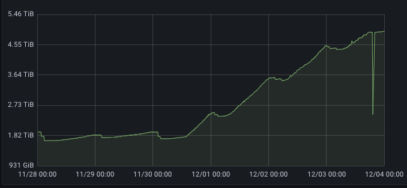
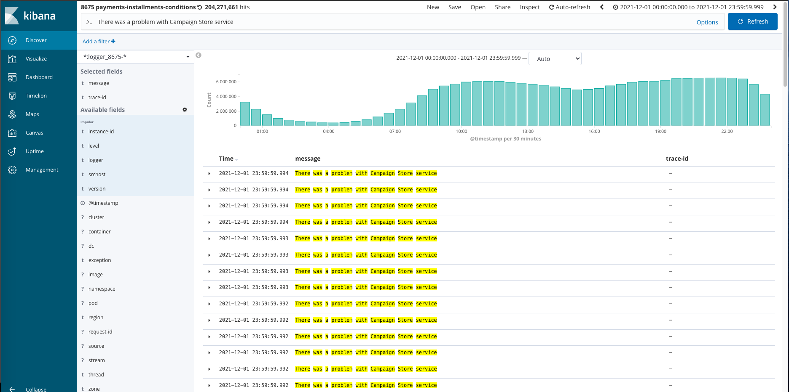
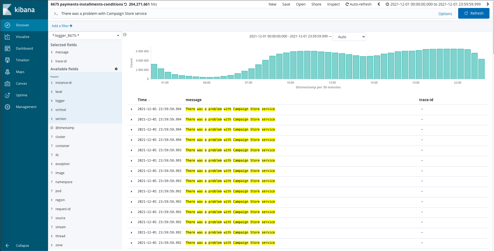
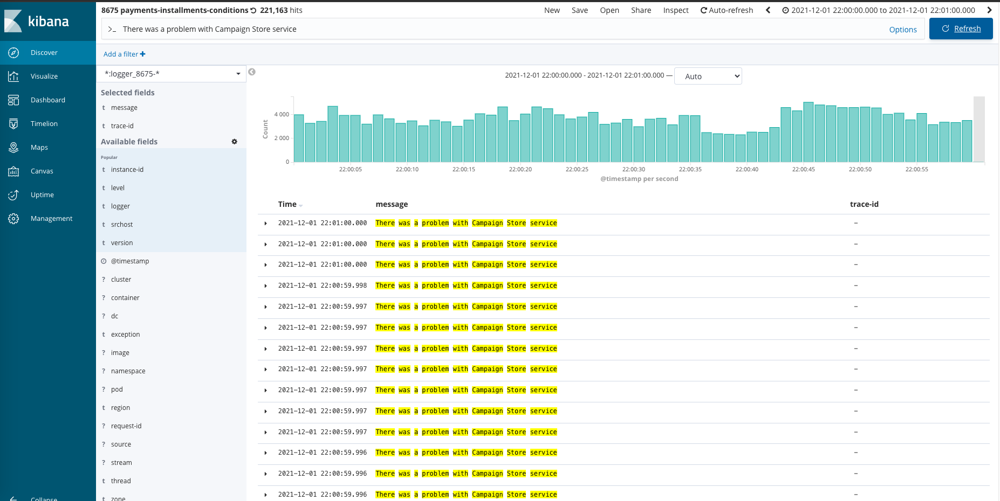
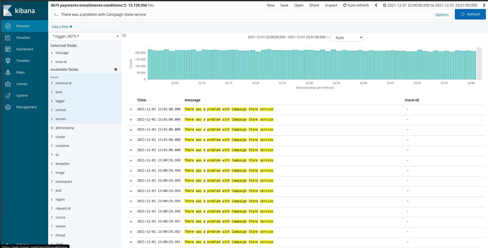
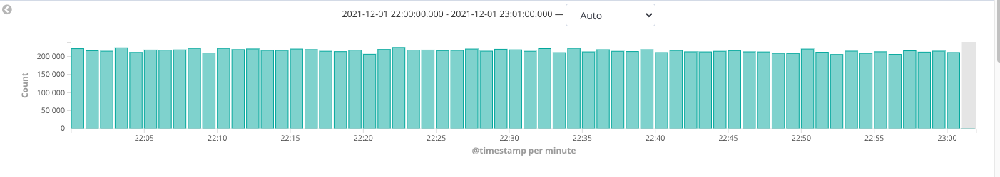
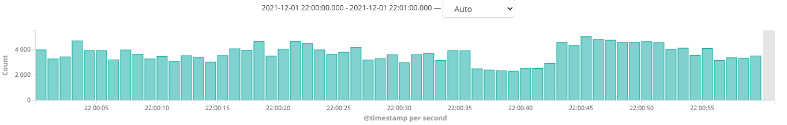
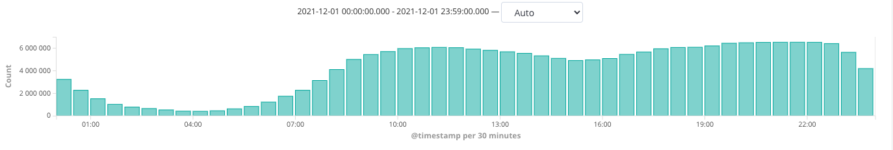

# Intro

W skomplikowanym systemie informatycznym składającym się z mikroserwisów nie jesteśmy w stanie ustrzec się
przed wystąpieniem problemów. Możemy jednak starać się je przewidywać i reagować na nie tak szybko, jak to tylko
możliwe.
Aby to osiągnąć, konieczne jest sięgnięcie po specjalistyczne narzędzia służące do oceny aktualnego stanu
komponentów naszego systemu. Są one przewidziane przez wzorzec architektury mikroserwisowej i realizują jeden z
głównych jego postulatów - *Observability*.

# Observability
Na samym początku spróbujmy odpowiedzieć sobie co to jest *Observability*.

Najprostsza definicja definiuje je tak: [Wikipedia](www.wikipedia.org todo)
>Observability is the ability to collect data about program execution, internal states of modules, and communication
> between components.

W artykule tym chciałbym opowiedzieć jak ważne są dla nas metryki oraz opisać własną przygodę z pewnego piątkowego
popołudnia, w której metryki odegrały znaczącą rolę.

Utrzymanie i rozwój dużego systemu rozproszonego wymaga rozległej wiedzy o charakterystyce jego działania. Wiedzy tej
Nasuwa się pytanie skąd taką wiedzę można pozyskać ? Tutaj z pomocą mogą przyjść systemy służące do gromadzenia metryk.

Dlatego w Allegro bieramy i kolekcjonujemy ogromne ilości danych liczbowych opisujących działanie naszych usług

Piąteczek...

Przed moim pierwszym dyżurem produkcyjnym przyszło mi do głowy pytanie, jaka jest szansa że w to piątkowe popołudnie
cokolwiek nietypowego się wydarzy . I chociaż Prawo Murphyego mówi że jest to zdarzenie pewne, to jednak

Goals:

* W Allegro lubimy metryki.
* Utrzymanie systemu rozproszonego skali Allegro stanowi duże wyzwanie dla zespołów developerskich.
* Uczymy się zachowania naszych serwisów.
* Metryki są źródłem wiedzy o systemie
* Pozwalają zareagować na nietypowe sytuacje zanim te spowoduja prawdziwe problemy.
* Pozwalają wyjaśnić przyczyny jeśli problemy się zdarzą.
* Pozwalają szacować i planować wprowadzanie nowych funkcjonalności

Nasze usługi są źródłem ogromnej ilości danych telemetrycznych. Wykorzystujemy je
do podejmowania decyzji (zarówno technicznych, jak i biznesowych). Z ich perspektywy patrzymy na nasz system,
uczymy się go i staramy się zrozumieć jego zachowania. Pozwala nam to reagować na sytuacje
nietypowe jeszcze zanim one staną się prawdziwym problemem.
