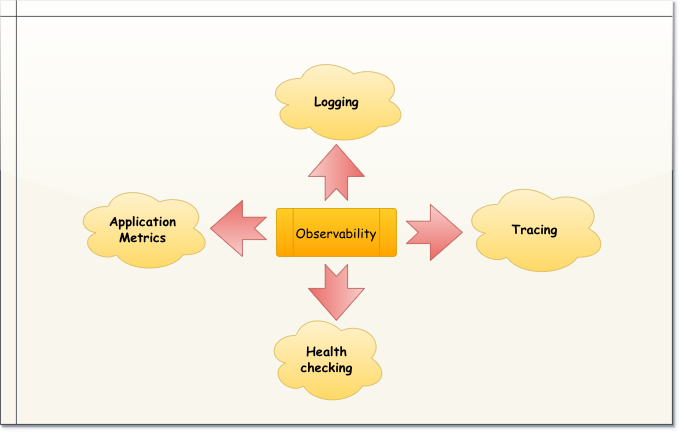
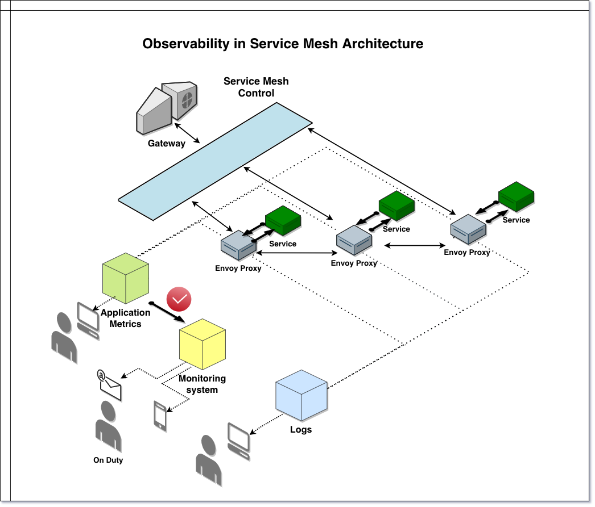
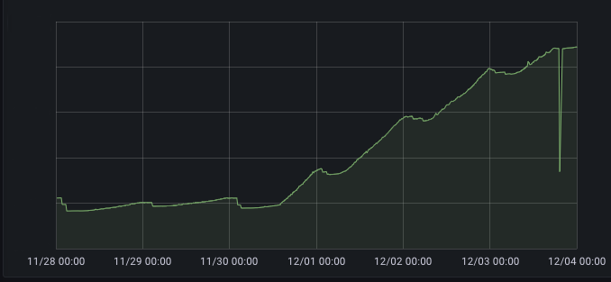
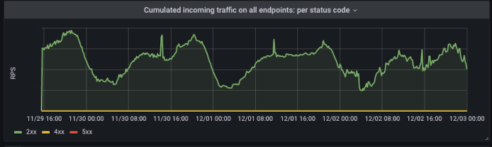
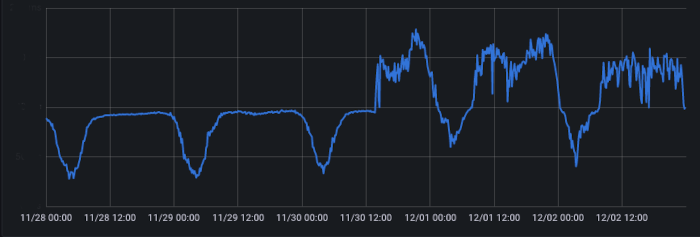
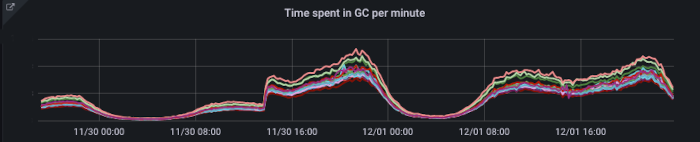
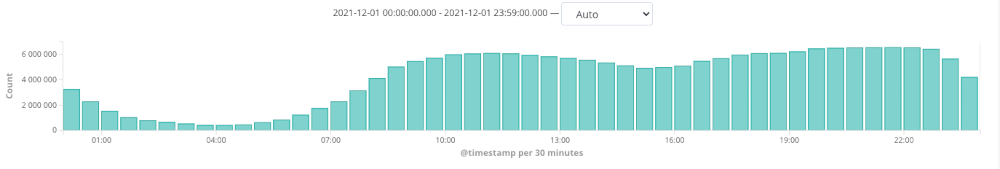
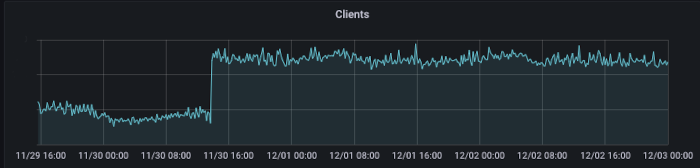
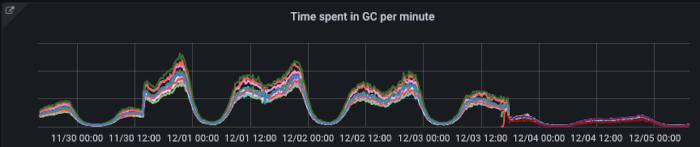
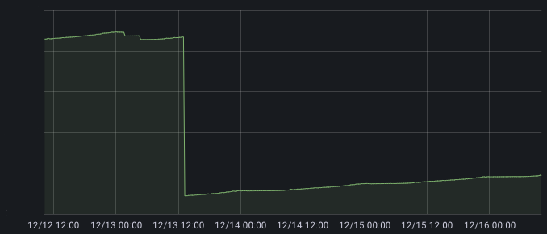

# Intro

In a complex microservice system, we are not able to avoid problems. However, we can try to anticipate them and react to
them as quickly as possible. To achieve this, it is necessary to use specialized tools to assess the current condition
of our components. They are provided for by the microservice architecture model and implement one of its main
postulates- *Observability*.

# Observability

Let's try to answer ourselve, how the term *Observability* should be understood.

I would like to quote a very simple definition found on _[Wikipedia](https://en.wikipedia.org/wiki/Observability)_

> Observability is the ability to collect data about program execution, internal states of modules, and communication
> between components.

The observable system provides precise data describing the condition of its components. This data can take many
forms-from numeric telemetry data to text records. Thanks to them, we are able to understand the characteristics of the
system behavior and the way of data flow. It allows us to catch subtle anomalies, that may not be a problem at this
moment, but they will become a problem soon. Effective developer intervention taken at this point of time allows
preserve system stability and reliability. And that this is what it's all about. We have the opportunity to act on the
cause before its negative effect occurs.

# Observability - implementation patterns

We intuitively feel that observability is a broad, abstract concept. According
to [Microservice Architecture Pattern](https://microservices.io/patterns/microservices.html), it can be decomposed into
several strongly cooperating, more specialized areas:



* **Logging**- Storage of textual information describing the operation of particular system components. Textual records
  are enriched in metadata, which allows for their later retrieval and processing.


* **Tracing**- It is a term describing the passing of a common identifier to all components implementing given business
  action of the user. Each of them uses this identifier to tag the logs that are put away.Thanks to this, we gain a
  correlating element, and it becomes possible to precisely trace the data flow in the system.


* **Application metrics** - Telemetry data describing the state and condition of individual the system components.


* **Health checking**- It is a pattern of system behavior assuming that each of its components is able to report that it
  is ready to process data at that moment in time.

The harmonious development of these areas ensures that good observability is maintained for the entire system.

# Monitoring system

One more detail should be noted here. The solutions discussed earlier are not sufficient to realize real-time
activities. Tools implementing these patterns are specialized for collecting and processing data. Nothing more. They are
not able to interpret them on their own and they are not able to distinguish the situation normal from exceptional. We
need one more player - _Monitoring System_.

Its main task is to monitor the collected telemetry data and check specific rules. In case of violation of the rules,
appropriate measures are taken, for example, the person on duty will be informed immediately.

We need to pay attention to how the rule starting the entire action was determined. Informing that the service has used
up all the available disk space and it no longer works, makes no sense. An error has occurred, the system has not
works ( we would have found out about it even without complicated measurements; ). A much better idea is a message like
this: "
80% of the available space has been exhausted. React and you will avoid trouble". And this is the secret of successfully
maintaining an extensive system. We have a reason to believe that in X amount of time the space will be exhausted and
the service will stop working. That X is the time to intervene effectively.

This action closes the cycle. A man becomes involved. However, he is not left alone. At this point, many details are
already known. We know in which place of the system an exceptional situation occurred, which rule was violated, where to
look for the cause. We have collected logs. We can act.

# Service Mesh



# Piątkowe popołudnie









```
exception java.lang.RuntimeException: Hystrix circuit short-circuited and is OPEN
    at com.netflix.hystrix.AbstractCommand.handleShortCircuitViaFallback(AbstractCommand.java:979)
    at com.netflix.hystrix.AbstractCommand.applyHystrixSemantics(AbstractCommand.java:557)
```





```
Error while extracting response for type
    [java.util.List<xxx.xxx.xxx.Dto>] and content type [application/vnd.allegro.public.v1+json]; nested exception is
    org.springframework.http.converter.HttpMessageNotReadableException: JSON parse error
    ...
```






