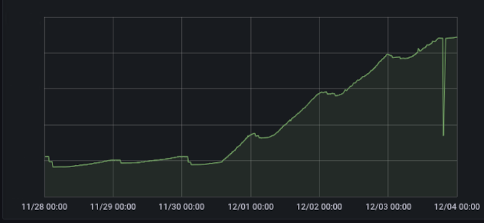

# Intro

In a complex microservice system, we are not able to avoid problems. However, we can try to anticipate them and react to
them as quickly as possible. To achieve this, it is necessary to use specialized tools to assess the current condition
of our components. They are provided for by the microservice architecture model and implement one of its main
postulates- *Observability*.

# Observability

# Observability - wzorce realizacyjne


# System monitorowania i informowania

# Service Mesh


# Piątkowe popołudnie




```
exception java.lang.RuntimeException: Hystrix circuit short-circuited and is OPEN
    at com.netflix.hystrix.AbstractCommand.handleShortCircuitViaFallback(AbstractCommand.java:979)
    at com.netflix.hystrix.AbstractCommand.applyHystrixSemantics(AbstractCommand.java:557)
```


```
Error while extracting response for type
    [java.util.List<xxx.xxx.xxx.Dto>] and content type [application/vnd.allegro.public.v1+json]; nested exception is
    org.springframework.http.converter.HttpMessageNotReadableException: JSON parse error
    ...
```


