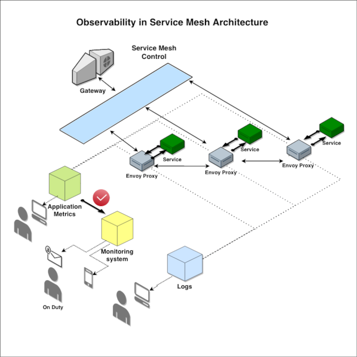
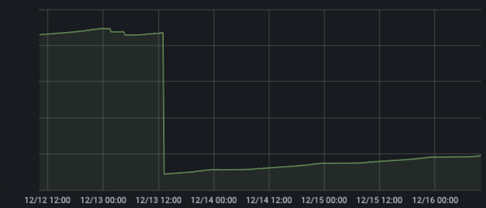

# Intro

When I joined the Allegro team, I was very curious about the issue of monitoring an extensive distributed system. I've
heard a lot about the fact that productive microservices are maintained directly by development teams and that this is
done without special monitoring departments.

From the literature I knew the design patterns and solutions used, but it was hard for me to imagine how it all works in
practice.

I wondered about a lot of things:

* What kind of tools are used to determine the condition of the system and how are they integrated with microservice
  architecture?
* Who distinguishes between correct and incorrect situations and makes the decision to initiate an emergency action?
* What really happens after a fault occurs, how is this information handled by the various layers of the system so that
  it finally reaches the right developer?
* What does the cooperation of people looking for the causes and removing the failure look like? What kind of data can
  they use to formulate and verification of hypotheses.

In this article I would like to introduce you to this very interesting aspect of working with microservices. I will tell
you about a situation which happened during my first duty, on Friday afternoon.

But one by one. I will start with the theory.

# Observability

In a complex microservice system, we are not able to avoid problems. However, we can try to anticipate them and react to
them as quickly as possible. To achieve this, it is necessary to use specialized tools to assess the current condition
of our components. They are provided for by the microservice architecture model and implement one of its main
postulates- *Observability*.

Let's try to answer ourselve, how the term *Observability* should be understood.

I would like to quote a very simple definition found on _[Wikipedia](https://en.wikipedia.org/wiki/Observability)_

> Observability is the ability to collect data about program execution, internal states of modules, and communication
> between components.

The observable system provides precise data describing the condition of its components. This data can take many
forms-from numeric telemetry data to text records. Thanks to them, we are able to understand the characteristics of the
system behavior and the way of data flow. It allows us to catch subtle anomalies, that may not be a problem at this
moment, but they will become a problem soon. Effective developer intervention taken at this point of time allows
preserve system stability and reliability. And that this is what it's all about. We have the opportunity to act on the
cause before its negative effect occurs.

# Observability - implementation patterns

We intuitively feel that observability is a broad, abstract concept. According
to [Microservice Architecture Pattern](https://microservices.io/patterns/microservices.html), it can be decomposed into
several strongly cooperating, more specialized areas:


* **Logging**- Storage of textual information describing the operation of particular system components. Textual records
  are enriched in metadata, which allows for their later retrieval and processing.


* **Tracing**- It is a term describing the passing of a common identifier to all components implementing given business
  action of the user. Each of them uses this identifier to tag the logs that are put away.Thanks to this, we gain a
  correlating element, and it becomes possible to precisely trace the data flow in the system.


* **Application metrics** - Telemetry data describing the state and condition of individual the system components.


* **Health checking**- It is a pattern of system behavior assuming that each of its components is able to report that it
  is ready to process data at that moment in time.

The harmonious development of these areas ensures that good observability is maintained for the entire system.

# Monitoring system

One more detail should be noted here. The solutions discussed earlier are not sufficient to realize real-time
activities. Tools implementing these patterns are specialized for collecting and processing data. Nothing more. They are
not able to interpret them on their own and they are not able to distinguish the situation normal from exceptional. We
need one more player - _Monitoring System_.

Its main task is to monitor the collected telemetry data and check specific rules. In case of violation of the rules,
appropriate measures are taken, for example, the person on duty will be informed immediately.

We need to pay attention to how the rule starting the entire action was determined. Informing that the service has used
up all the available disk space and it no longer works, makes no sense. An error has occurred, the system has not
works ( we would have found out about it even without complicated measurements; ). A much better idea is a message like
this: "
80% of the available space has been exhausted. React and you will avoid trouble". And this is the secret of successfully
maintaining an extensive system. We have a reason to believe that in X amount of time the space will be exhausted and
the service will stop working. That X is the time to intervene effectively.

This action closes the cycle. A man becomes involved. However, he is not left alone. At this point, many details are
already known. We know in which place of the system an exceptional situation occurred, which rule was violated, where to
look for the cause. We have collected logs. We can act.

# Service Mesh

When we imagine the code responsible for collecting metrics and gathering logs, we can come to the right conclusion,
that it must be very generic. Is it possible to avoid repeating it for each individual service? It turns out that yes.
With help comes another powerful microservices architecture pattern called Service Mesh. It is very complicated and has
many functions, details of which can be found in another article (TODO LINK).

From the viewpoint of observability, the most important thing is that, it assumes the existence of proxy components (
called sidecars), through which all traffic directed to the service passes through. These are the places where we can
take all the measurements, read input and output messages, and then send them to the appropriate gathering systems.

Such proxy services can be generated completely automatically, without the developer's involvement. They provide a
complete separation of business and technical code.

The analysis of the situation has begun. At the beginning, we reached for the metric describing the daily increase in
the size of the log file.



# Friday afternoon

For the Allegro system, the observability aspect is really crucial. Our services collect huge amounts of telemetry data
all the time. The monitoring applications continuously check whether they are within the given ranges, and if
irregularities are detected, the on-call staff is automatically notified.

To show you how this system works in practice, I will tell you about a failure that happened to me during my first one,
independent production duty on Friday afternoon.

It all started with a call from the infrastructure team on duty with the information that for some time, one of our
services has been behaving very unstably. It was observed an unnatural, abrupt increase in the size of the logs. This
situation was noted by the monitoring system and triggered an alarm.


The situation was very strange. Between 30/11 and 01/12 something affected our service. The chart shows dramatic
increase in the rate of log stacking.

But does it have to be a failure right away? After all, we have entered a period of increased traffic, and the service
collects a lot as standard logs. Maybe their increase is due to the increased number of serviced requests?

This hypothesis seemed unlikely given the magnitude of the observed anomaly, but it still needed to be verified.

We reached for a second metric - showing the distribution of traffic coming into the service.


The curve did not show any anomalies. The service handled normal, typical traffic during the observed period.

We see natural fluctuations that should be associated with the daily distribution of user activity, but there is
certainly anything that would explain such behavior of the service.

Analysis of another relationship provided interesting information. This time we looked at the response times of our
service.


The metrics clearly showed that our service performance has clearly deteriorated since early December. Everyone using
our functionality must have noticed a decrease in performance. The delays were not long enough to set off alarm bells,
but they became clearly noticeable.

In the next step, we decided to narrow the analysis area even further and look at how the java virtual machine works. We
reached for another metric - this time depicting the work of the GC.


It was easily noticeable that it has become much less efficient since the turn of November and December. It has more and
more problems with freeing up resources and consumes much more CPU time. This, in turn, explains the previously noticed
decrease performance of the entire application.

Another hypothesis has emerged. Maybe the bug lies in the service itself. Maybe there was some code change which
degrades the application's performance.

However, after verifying the deployment logs, it was found that the application was not deployed during this period. The
problem had to be found elsewhere.

The metrics gave us a general overview of the situation. We knew that our service had been malfunctioning for some time.
Despite stable levels of input traffic, responses had become noticeably slower. The JVM began to run much less
efficient, and the service was putting off huge amounts of logs. It was also possible to determine the point in time
when the problems started. It was now possible to narrow the search area considerably and look at the logs.

We found multiple occurrences of the same exception there. Its source was our circuit breaker.

```
exception java.lang.RuntimeException: Hystrix circuit short-circuited and is OPEN
    at com.netflix.hystrix.AbstractCommand.handleShortCircuitViaFallback(AbstractCommand.java:979)
    at com.netflix.hystrix.AbstractCommand.applyHystrixSemantics(AbstractCommand.java:557)
```

It is a mechanism protecting against the problem called "cascading failures", i.e. propagation of errors from one
service on its clients. If in a defined period of time the number of unsuccessful calls to a service is higher than the
assumed value, the circuit breaker opens the cirumstace, and service stops being queried. The client does not receive an
error, but a previously prepared default object. The appearance of this message clearly indicated a lack of
communication with the called service.

Unfortunately the situation did not look very good. Due to the high traffic the stacktrace was stored in the logs 6
thousand times per minute. During only one hour 6 million exceptions were logged. The service was rapidly consuming disk
space on the disk. And the whole situation was still going on!


So what was the root cause of the exception issue ? Maybe one of the services responds so slowly that the timeout
provided for the client is exceeded ? It was necessary to look at the characteristics that describe the communication
between services. In order to do that, we again looked into the metrics.


And here we found that at the turn of the month the quality of communication with one of the services deteriorated
dramatically. Could this be the cause of the problems? If so, simply increasing the timeout value for the client should
solve the problem.

We made a hot fix and expected a significant improvement, which unfortunately did not happen.

Huge amounts of exception stacks were going into the logs all the time. Their source was still Hystrix. So the reason
could not be timeout. Again, we went back to analyze the logs.

And then we found out that we have another problem - we are not able to read the response that is returned to us:

```
Error while extracting response for type
    [java.util.List<xxx.xxx.xxx.Dto>] and content type [application/vnd.allegro.public.v1+json]; nested exception is
    org.springframework.http.converter.HttpMessageNotReadableException: JSON parse error
    ...
```

This was already looking serious. A break of contract had occurred. The message that's coming to us can't be properly
read. At some point its structure had been changed, and we didn't find about it. That must have been the cause of the
problem!

After reporting to the on duty in the owners team of the defective service, we found out that there was indeed a mistake
and the name of one of the fields in the DTO object has been changed. And this was the root cause of all the confusion.

Refining the model immediately solved the problem. GC regained its former efficiency:


and the growth of the log file has been greatly reduced.



How did it happen that such a serious failure went unnoticed by the monitoring systems?

As usual in such situations, it turned out that there is no single root cause.

First, it turned out that exception frames were logged not at ERROR but WARN level. But is this an error? After all,
everything worked correctly, the external service returned its response with a status of 200. From its point of view
everything was fine. We were not able to read the response and an exception occurred, but it was handled by Circuit
Breaker. Stack trace went to log and communication was resumed. Our client did not receive information about the error,
but it was returned a default response object called fallback.

What could we improve so that the situation does not happen again ?

There is no doubt that we were missing a very important metric. If we had monitored the number of fallback responses per
time interval, we would have undoubtedly detected the problem much earlier.

TODO szkatuła
