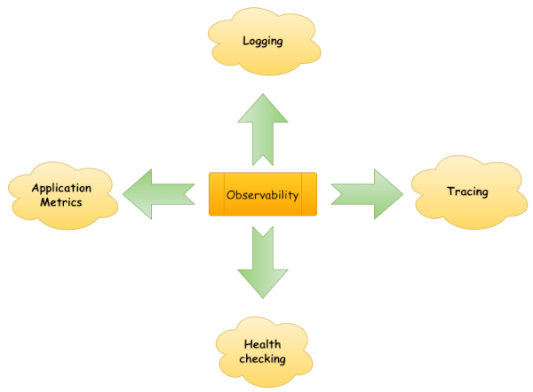
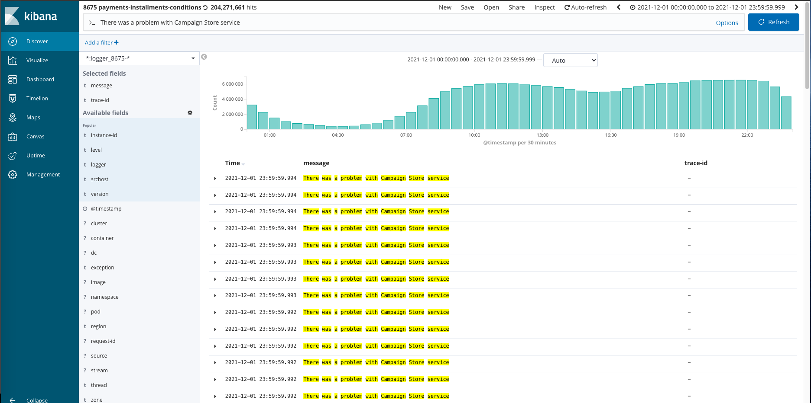
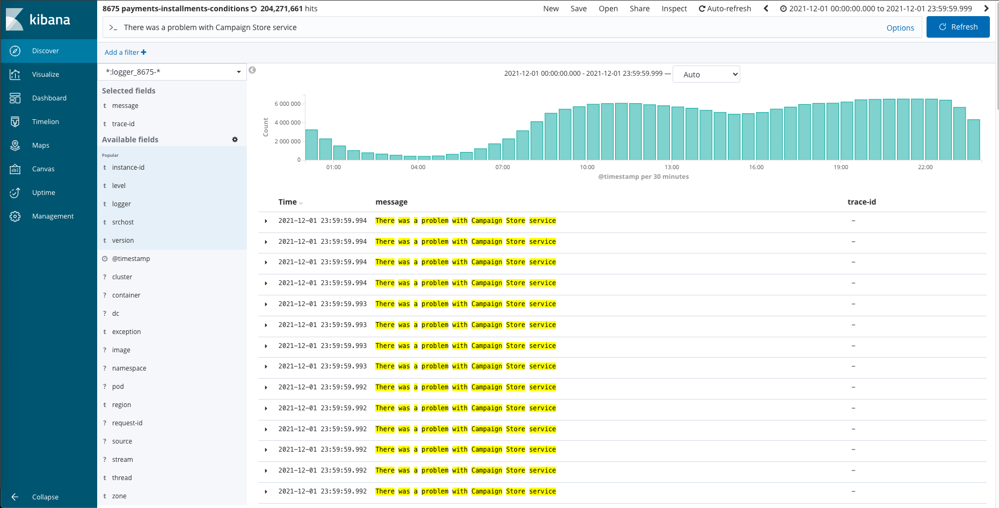
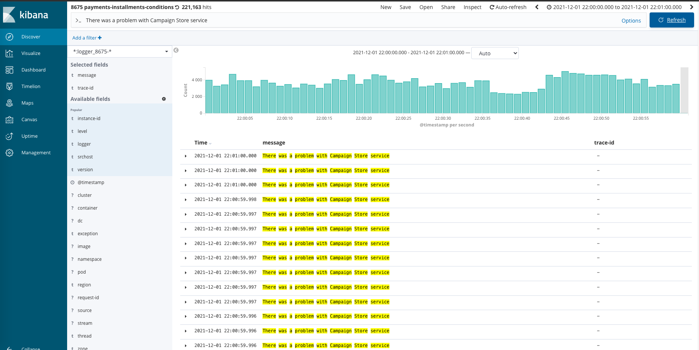
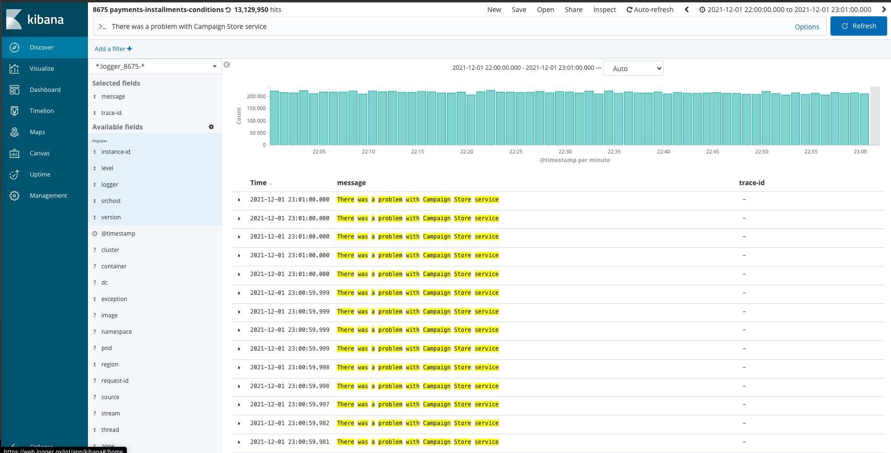
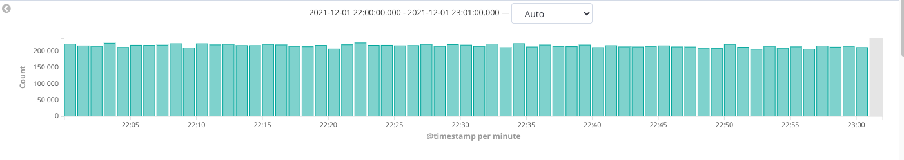
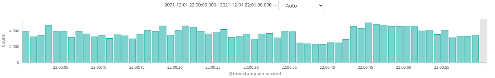
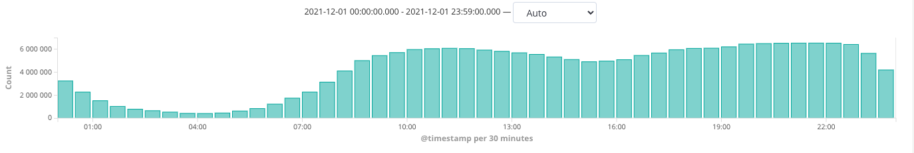

# Intro

W skomplikowanym systemie informatycznym składającym się z mikroserwisów nie jesteśmy w stanie ustrzec się przed
wystąpieniem problemów. Możemy jednak starać się je przewidywać i reagować na nie tak szybko, jak to tylko możliwe. Aby
to osiągnąć, konieczne jest sięgnięcie po specjalistyczne narzędzia służące do oceny aktualnego stanu komponentów
naszego systemu. Są one przewidziane przez wzorzec architektury mikroserwisowej i realizują jeden z głównych jego
postulatów - *Observability*.

# Observability

Spróbujmy odpowiedzieć sobie, jak rozumieć należy pojęcie *Observability*.

> Observability is the ability to collect data about program execution, internal states of modules, and communication
> between components. Wikipedia()

System obserwowalny jest przede wszystkim poznany i oswojony. Dostarcza precyzyjnych danych opisujących stan i kondycję
swoich komponentów. Dane te mogą one mieć bardzo różną postać. Są to zarówno liczbowe dane telemetryczne, jak i tekstowe
zapisy logów. Dzięki nim jesteśmy w stanie zrozumieć charakterystykę zachowań systemu i sposób przepływu danych. To z
kolei pozwala na wychwytywanie subtelnych anomalii, które w chwili wystąpienia nie stanowią problemu, ale są przesłanki,
że wkrótce nim się staną. Skuteczna reakcja w tym właśnie momencie pozwala na zachowanie stabilności i ciągłości
działania. I o to właśnie chodzi. Mamy możliwość zadziałania na przyczynę, zanim pojawi się jej negatywny skutek.

Zachowanie systemu jest dobrym przybliżeniem zachowań jego użytkowników. Ten naturalnie stworzony model pozwala na
wyciągnięcie wniosków co do oczekiwanych kierunków rozwoju. Może stanowić zatem podstawę do podejmowania decyzji nie
tylko technicznych, ale też (a może przede wszystkim) biznesowych. Jest to jego kolejna, ogromna zaleta.

# Observability - wzorce realizacyjne

Intuicyjnie czujemy, że obserwowalność jest pojęciem pojemnym, abstrakcyjnym.
Według [modelu architektury mikroserwisowej](https://microservices.io/patterns/microservices.html) może ona zostać
zdekomponowana na kilka silnie współpracujących ze sobą, bardziej wyspecjalizowanych obszarów:

<!--
[źródło tego podziału: https://searchapparchitecture.techtarget.
com/tip/The-basics-of-monitoring-and-observability-in-microservices]
-->

!

* Logowanie - Polega na odkładaniu w specjalnych bazach informacji tekstowych opisujących działanie poszczególnych
  komponentów. Są one opatrywane przez metadane pozwalające na późniejsze ich wyszukiwanie i przetwarzanie.
* Śledzenie - Jest to koncept polegający przekazywaniu wspólnego identyfikatora do wszystkich komponentów realizujących
  daną akcję biznesową użytkownika. Identyfikator ten trafia do logów przez nie generowanych. Dzięki temu zyskujemy
  element korelujący i możliwe staje się dokładne prześledzenie przepływu danych w systemie.
* Metryki aplikacyjne - Mają postać danych telemetrycznych informujących o kondycji poszczególnych komponentów
  składających się na system.
* Health check - Jest to wzorzec zachowania polegający na tym, że wszystkie komponenty należące do danego systemu są w
  stanie poinformować go czy w danej chwili są zdolne do przetwarzania danych. Można wyobrazić sobie sytuację, że
  komponent sterujący ruchem co jakiś czas odpytuje zarejestrowane usługi i upewnia się, że może im bezpiecznie
  przekazać sterowanie.

Harmonijny rozwój tych obszarów zapewnia utrzymanie dobregit j obserwalności dla całego systemu.

# System monitorowania i informowania

Tu należy zwrócić uwagę na jeszcze jeden szczegół. Omówione wcześniej rozwiązania nie są wystarczające do skutecznego
działania w czasie rzeczywistym. Narzędzia realizujące te wzorce wyspecjalizowane są do gromadzenia i przetwarzania
danych. Nic więcej. Nie są w stanie ich samodzielnie interpretować, a co za tym idzie, nie potrafią odróżnić sytuacji
normalnej od wyjątkowej. Potrzebny jest jeszcze jeden gracz - _system monitorujący_.

Jego głównym zadaniem jest monitorowanie odkładanych danych telemetrycznych i sprawdzanie określonych reguł. W przypadku
ich naruszenia wykonana musi zostać odpowiednia akcja, na przykład powiadomienie osoby pełniącej dyżur.

Musimy zwrócić uwagę na to, jak określona została reguła uruchamiająca całą akcję. Informowanie, że usługa zużyła całą
dostępną przestrzeń na dysku i już nie działa, nie ma żadnego sensu. Mleko się rozlało, błąd wystąpił, system nie
działa (dowiedzielibyśmy się o tym nawet bez skomplikowanych pomiarów ;). Dużo lepszym pomysłem jest informacja typu: "
Wyczerpane zostało 80% procent dostępnego miejsca. Zareaguj, a unikniesz kłopotów". I właśnie to jest cała tajemnica
skutecznego utrzymywania rozległego systemu. Mamy przesłankę, by sądzić, że za X czasu miejsce zostanie wyczerpane, a
usługa przestanie działać. Ten X to czas na skuteczną interwencję.

Ta akcja domyka cykl. Zaangażowany zostaje człowiek. Nie pozostaje on jednak pozostawiony sam. W tym momencie znanych
jest już wiele szczegółów. Wiadomo, w którym miejscu systemu wystąpiła sytuacja wyjątkowa, która reguła została
naruszona, gdzie należy szukać przyczyny. Mamy zgromadzone logi. Możemy działać.

# Service Mesh

Gdy wyobrazimy sobie kod odpowiedzialny za zbieranie metryk i gromadzenie logów, to możemy dojść do słusznego wniosku,
że musi on być bardzo generyczny. Czy można uniknąć zatem poowtarzania go dla każdej usłgi z osobna ? Okazuje się, że
tak. Z pomocą przychodzi kolejny potężny wzorzec architektury mikroserwisowej nazywany Service Mesh. Jest on bardzo
skomplikowany i pełni wiele różnorakich funkcji, szczegóły można poznać w innym artykule TODO. Z punktu widzenia
observability najważniejsze jest to, że zakłada on istnienie tzw. siedecars. Są to komponenty proxy, przez
które przechodzi cały ruch skierowany do usługi. Jest to punkt, w którym można dokonać wszelkich pomiarów, odczytać
komunikaty wejściowe i wyjściowe, a potem skomunikować się z odpowiednimi systemami gromadzącymi je. Takie usługi
proxy mogą być generowane całkowicie automatycznie, bez wiedzy dewelopera. Dzięki nim uzyskuje się
całkowitą separację kodu biznesowego i kodu technicznego.

# Friday evening

I tak właśnie działamy w Allegro. Zbieramy ogromne ilości danych telemetrycznych, przetwarzamy je, staramy się wyciągać
właściwe wnioski. Ciężko mi wyobrazić sobie jakiekolwiek planowanie bez odniesienia do metryk i logów.

