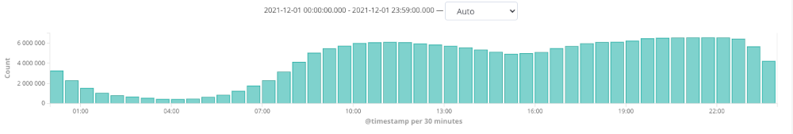
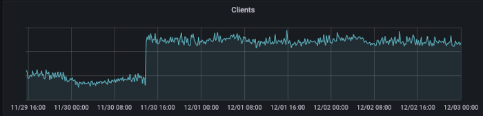

# Intro

**Gdy dołączałem do zespołu Allegro bardzo ciekawiło mnie zagadnienie monitorowania rozległego systemu rozproszonego.
Dużo słyszałem o tym, że mikroserwisy działające produkcyjnie utrzymywane są bezpośrednio przez zespoły developerskie i
że odbywa się to bez specjalnych działów monitorujących.**

**Z literatury znałem wzorce projektowe i stosowane rozwiązania, jednak ciężko mi było wyobrazić sobie, jak to wszystko
działa w praktyce.**

**Zadawałem sobie pytania, jakie narzędzia wykorzystywane są do określania kondycji systemu i w jaki sposób wkomponowane
zostały w architekturę mikroserwisowa? Kto ocenia, że określona sytuacja jest niepoprawna i należy ją zaraportować?

**Co tak naprawdę dzieje sie po wystąpieniu błędu, jak informacja ta przebiega przez różne warstwy, by na końcu dotrzeć
do właściwego developera.**

**Wreszcie jak wygląda szukanie przyczyny i współpraca zaangażowanych do tego osób. Jekie dane można wykorzystać do
formułowania i weryfikacji hipotez.**

W tym artykule chciałbym przybliżyć Wam ten bardzo ciekawy aspekt pracy z mikroserwisami. Opowiem o sytuacji, która
wydarzyła się podczas mojego pierwszego dyżuru, w piątkowe popołudnie. Ale po kolei. Zacznę od teorii.**

### Observability

W skomplikowanym systemie informatycznym składającym się z mikroserwisów nie jesteśmy w stanie ustrzec się przed
wystąpieniem problemów. Możemy jednak starać się je przewidywać i reagować na nie tak szybko, jak to tylko możliwe. Aby
to osiągnąć, konieczne jest sięgnięcie po specjalistyczne narzędzia służące do oceny aktualnego stanu komponentów
naszego systemu. Są one przewidziane przez wzorzec architektury mikroserwisowej i realizują jeden z głównych jego
postulatów - *Observability*.

Spróbujmy odpowiedzieć sobie, jak rozumieć należy pojęcie *Observability*.

> Observability is the ability to collect data about program execution, internal states of modules, and communication
> between components.
>
> _source: Wikipedia_

System obserwowalny dostarcza precyzyjnych danych opisujących stan swoich komponentów. Mogą mieć one bardzo różną
postać- od liczbowych danych telemetrycznych aż do tekstowych zapisów logów. Dzięki nim jesteśmy w stanie zrozumieć
charakterystykę zachowań systemu i sposób przepływu danych. To z kolei pozwala na wychwytywanie subtelnych anomalii,
które w chwili wystąpienia nie stanowią problemu, ale możemy przypuszczać, że wkrótce nim się staną. Skuteczna
interwencja deweloperska podjęta w tym momencie pozwala na zachowanie stabilności i niezawodności systemu. I o to
właśnie chodzi. Mamy możliwość zadziałania na przyczynę, zanim pojawi się jej negatywny skutek.

Zachowanie systemu jest dobrym przybliżeniem zachowań jego użytkowników. Ten naturalnie stworzony model pozwala na
wyciągnięcie wniosków co do oczekiwanych kierunków rozwoju. Może stanowić zatem podstawę do podejmowania decyzji nie
tylko technicznych, ale też (a może przede wszystkim) biznesowych. Jest to jego kolejna, ogromna zaleta.

### Observability - wzorce realizacyjne

Intuicyjnie czujemy, że obserwowalność jest pojęciem pojemnym, abstrakcyjnym.
Według [modelu architektury mikroserwisowej](https://microservices.io/patterns/microservices.html) może ona zostać
zdekomponowana na kilka silnie współpracujących ze sobą, bardziej wyspecjalizowanych obszarów:

<!--
[źródło tego podziału: https://searchapparchitecture.techtarget.
com/tip/The-basics-of-monitoring-and-observability-in-microservices]
-->


* Logowanie -Polega na odkładaniu w specjalnych bazach informacji tekstowych opisujących działanie poszczególnych
  komponentów. Są one opatrywane przez metadane pozwalające na późniejsze ich wyszukiwanie i przetwarzanie.
* Śledzenie -Jest to pojęcie określające przekazywanie wspólnego identyfikatora do wszystkich komponentów realizujących
  daną akcję biznesową użytkownika. Każdy z nich loguje wykonywane przez siebie akcje i opatruje je otrzymanym
  identyfikatorem. Dzięki temu zyskujemy element korelujący i możliwe staje się dokładne prześledzenie przepływu danych
  w systemie.
* Metryki aplikacyjne -Mają postać danych telemetrycznych informujących o kondycji poszczególnych komponentów
  składających się na system.
* Health check -Jest to wzorzec zachowania polegający na tym, że wszystkie komponenty należące do danego systemu są w
  stanie poinformować go czy w danej chwili są zdolne do przetwarzania danych. Można wyobrazić sobie sytuację, że
  komponent sterujący ruchem co jakiś czas odpytuje zarejestrowane usługi i upewnia się, że może im bezpiecznie
  przekazać sterowanie.

Harmonijny rozwój tych obszarów zapewnia utrzymanie dobregit j obserwalności dla całego systemu.

### System monitorowania i informowania

Tu należy zwrócić uwagę na jeszcze jeden szczegół. Omówione wcześniej rozwiązania nie są wystarczające do skutecznego
działania w czasie rzeczywistym. Narzędzia realizujące te wzorce wyspecjalizowane są do gromadzenia i przetwarzania
danych. Nic więcej. Nie są w stanie ich samodzielnie interpretować, a co za tym idzie, nie potrafią odróżnić sytuacji
normalnej od wyjątkowej. Potrzebny jest jeszcze jeden gracz - _system monitorujący_.

Jego głównym zadaniem jest monitorowanie odkładanych danych telemetrycznych i sprawdzanie określonych reguł. W przypadku
ich naruszenia wykonana musi zostać odpowiednia akcja, na przykład powiadomienie osoby pełniącej dyżur.

Musimy zwrócić uwagę na to, jak określona została reguła uruchamiająca całą akcję. Informowanie, że usługa zużyła całą
dostępną przestrzeń na dysku i już nie działa, nie ma żadnego sensu. Mleko się rozlało, błąd wystąpił, system nie
działa (dowiedzielibyśmy się o tym nawet bez skomplikowanych pomiarów ;). Dużo lepszym pomysłem jest informacja typu: "
Wyczerpane zostało 80% procent dostępnego miejsca. Zareaguj, a unikniesz kłopotów". I właśnie to jest cała tajemnica
skutecznego utrzymywania rozległego systemu. Mamy przesłankę, by sądzić, że za X czasu miejsce zostanie wyczerpane, a
usługa przestanie działać. Ten X to czas na skuteczną interwencję.

Ta akcja domyka cykl. Zaangażowany zostaje człowiek. Nie pozostaje on jednak pozostawiony sam. W tym momencie znanych
jest już wiele szczegółów. Wiadomo, w którym miejscu systemu wystąpiła sytuacja wyjątkowa, która reguła została
naruszona, gdzie należy szukać przyczyny. Mamy zgromadzone logi. Możemy działać.

### Service Mesh

Gdy wyobrazimy sobie kod odpowiedzialny za zbieranie metryk i gromadzenie logów, to możemy dojść do słusznego wniosku,
że musi on być bardzo generyczny. Czy można uniknąć powtarzania go dla każdej usłgi z osobna ? Okazuje się, że tak. Z
pomocą przychodzi kolejny potężny wzorzec architektury mikroserwisowej nazywany Service Mesh. Jest on bardzo
skomplikowany i pełni wiele różnorakich funkcji, szczegóły można poznać w
artykule [ Migrating to Service Mesh ](https://blog.allegro.tech/2020/05/migrating-to-service-mesh.html). Z punktu
widzenia observability najważniejsze jest to, że zakłada on istnienie komponentów proxy (zwanych sidecars), przez które
przechodzi cały ruch skierowany do usługi. Są to miejsca, w których możemy dokonać wszelkich pomiarów, odczytać
komunikaty wejściowe i wyjściowe, a potem wysłać je do odpowiednich systemów gromadzących. Takie usługi proxy mogą być
generowane całkowicie automatycznie, bez udziału dewelopera. Dzięki nim uzyskuje się całkowitą separację kodu
biznesowego i kodu technicznego.


### Piątkowe popołudnie

Dla systemu Allegro aspekt obserwowalności ma kluczowe znaczenie. Nasze usługi cały czas zbierają ogromne ilości danych
telemetrycznych. Aplikacje monitorujące na bieżąco sprawdzają, czy mieszczą się w one w zadanych przedziałach, a w razie
stwierdzenia nieprawidłowości automatycznie powiadamiani są dyżuranci.

Aby pokazać Wam, jak system ten działa w praktyce, opowiem o awarii, która przydarzyła mi się podczas mojego pierwszego,
samodzielnego dyżuru produkcyjnego, nomen omen w piątkowe popołudnie.

**Wszystko rozpoczęło się telefonem od dyżurnego jednego z zespołów. Otrzymałem informację, że od jakiegoś czasu jedna z
naszych usług zachowuje się bardzo niestabilnie. Zaobserwowany został nienaturalny, skokowy przyrost rozmiaru
odkładanych przez nią logów. Sytuacja ta została odnotowana przez system monitoringu i uruchomiła alarm.**

Rozpoczęliśmy analizę sytuacji. Na początek sięgnęliśmy po metrykę opisującą dzienne przyrosty rozmiaru pliku z logami.


Sytuacja wyglądała bardzo dziwnie. Pomiędzy 30.11 a 01.12 coś wpłynęło na naszą usługą. Na wykresie widać dramatyczny
wzrost tempa odkładania logów.

Tylko czy to od razu musi być awaria ? Przecież weszliśmy w okres wzmożonego ruchu, a usługa standardowo gromadzi sporo
logów. Może ich przyrost wynika ze zwiększonej ilości obsługiwanych żądań?

Ta hipoteza wydawała się mało realna ze względu na skalę zaobserwowanej anomalii, ale jednak należało ją zweryfikować.

Sięgnęliśmy zatem po drugą metrykę -tym razem obrazującą rozkład ruchu przychodzącego do usługi.


Krzywa nie pokazywała żadnych anomalii. Usługa w obserwowanym okresie obsługiwała normalny, typowy dla siebie ruch.
Widzimy naturalne wahania, które wiązać należy z dobowym rozkładem aktywności użytkowników, ale na pewno nie nie ma tu
niczego, co tłumaczyłoby takie zachowanie usługi.

Ciekawych informacji dostarczyła analiza kolejnej zależności. Tym razem przyjrzeliśmy się czasom odpowiedzi naszej
usługi.


Metryka wyraźnie pokazała, że od początku grudnia parametry naszej usługi wyraźnie się pogorszyły. Wszyscy korzystający
z naszej funkcjonalności musieli dostrzec spadek wydajności. Opóźnienia nie były na tyle duże, by uruchomić alarm, ale
stały się wyraźnie zauważalne.

W kolejnym kroku postanowiliśmy jeszcze bardziej zawęzić obszar analizy i przyjrzeć się jak pracuje wirtualna maszyna
java. Sięgnęliśmy po kolejną metrykę -tym razem obrazującą pracę GC.


Bez trudu dało się zauważyć, że od przełomu listopada i grudnia stał się on dużo mniej wydajny. Ma on coraz większe
problemy ze zwolnieniem zasobów i zużywa dużo więcej czasu procesora. To z kolei tłumaczy zauważony wcześniej spadek
wydajności całej aplikacji.

Pojawiła się kolejna hipoteza. Może błąd leży w samej usłudze. Może odbyło jakieś wdrożenie, wraz z którym do kodu
trafiła zmiana pogarszająca działanie aplikacji.

Jednak po weryfikacji logów deploymentu okazało się, że aplikacja w tym okresie nie była wdrażana. Problemu znowu trzeba
było szukać gdzie indziej.

**Metryki dały nam ogólne spojrzenie na sytuację. Wiedzieliśmy, że nasza usługa od pewnego czasu działa nieprawidłowo.
Pomimo stabilnego poziomu ruchu wejściowego, odpowiedzi stały się wyraźnie wolniejsze. JVM zaczął pracować dużo
mniej wydajnie, a usługa odkłada ogromne ilości logów. Udało się też określić punkt w czasie kiedy rozpoczęły się
problemy. Teraz można było znacznie zawęzić obszar poszukiwań i przyjrzeć się logom.**

Okazało się, że wielokrotnie pojawia się w nich stacktrace, którego źródłem jest nasz circuit breaker.

```
exception java.lang.RuntimeException: Hystrix circuit short-circuited and is OPEN
    at com.netflix.hystrix.AbstractCommand.handleShortCircuitViaFallback(AbstractCommand.java:979)
    at com.netflix.hystrix.AbstractCommand.applyHystrixSemantics(AbstractCommand.java:557)
```

**Jest to mechanizm zabezpieczający przed problemem nazywanym "kaskadą błędów", czyli propagacją błędów jednego serwisu
na jego klientów. Jeśli w określonym przedziale czasu liczba nieudanych wywołań serwisu będzie większa od założonej
wartości, to przestaje on być odpytywany. Klient nie otrzymuje błędu, tylko przygotowany wcześniej obiekt domyślny.
Pojawienie się tego komunikatu jednoznacznie wskazywało na brak komunikacji z wywoływanym serwisem.**

**Niestety sytuacja wyglądała niezbyt dobrze. Ze względu na duży ruch stacktrace odkładał się w logach 6 tys razy na
minutę. W ciągu jednej tylko godziny zalogowanych zostało 6 mln wyjątków. Usługa błyskawicznie zużywała przewidziane dla
niej miejsce na dysku. A cała sytuacja ciągle trwała !**



Co zatem było pierwotną przyczyną emisji wyjątków ? Może któraś z usług odpowiada na tyle wolno, że przekroczony zostaje
timeout przewidziany dla klienta ? Należało przyjrzeć się charakterystyce opisującej komunikację pomiędzy usługami. W
tym celu ponownie sięgnęliśmy do metryk.



I tu okazało się, że na przełomie miesięcy dramatycznie pogorszyła się jakość komunikacji pomiędzy naszym serwisem a
jedną z usług. Czyżbyśmy znaleźli przyczynę ? Jeśli tak, to zwykłe zwiększenie wartości timeout dla klienta powinno
rozwiązać problem.

Wprowadziliśmy szybką poprawkę i oczekiwaliśmy znaczącej poprawy, która niestety nie nastąpiła.

Do logów cały czas trafiały ogromne ilości stosów wyjątków, których źródłem był Hystrix. Więc przyczyną nie mógł być
timeout. Ponownie wróciliśmy do analizy danych.

**I wtedy okazało się, że mamy jeszcze jeden problem -nie jesteśmy w stanie odczytać zwracanej nam odpowiedzi**

```
Error while extracting response for type
    [java.util.List<xxx.xxx.xxx.Dto>] and content type [application/vnd.allegro.public.v1+json]; nested exception is
    org.springframework.http.converter.HttpMessageNotReadableException: JSON parse error
    ...
```

**To wyglądało już poważnie. Doszło do złamania kontraktu. Wiadomość, która do nas dociera, nie może zostać prawidłowo
odczytana. W którymś momencie zmieniła się jej struktura. To musiała być przyczyna problemu ! Po zgłoszeniu do dyżuranta
w zespole właścicieli wadliwej usługi dowiedzieliśmy się, że rzeczywiście doszło do pomyłki i w obiekcie DTO została
zmieniona nazwa jednego z pól. I właśnie to była pierwotna przyczyna całego zamieszania.**

**Szybko dokonaliśmy uspójnienia modelu, a to natychmiast rozwiązało problem.**

**Po sprawdzeniu metryk okazało się, że GC odzyskał dawną efektywność**


a przyrost pliku logów został znacznie ograniczony.


### Podsumowanie

**Gdy problem został już rozwiązany, stabilność przywrócona, mogliśmy sobie zadać pytanie, jak to się stało, że tak
poważna awaria została niezauważona przez systemy monitorujące ?**

**Czy nasza usługa mogła w tej sytuacji zachować się lepiej ?**

**Według mnie, wszystkie mechanizmy zadziałały poprawnie. Usługa zewnętrzna zwróciła swoją odpowiedź ze statusem 200. Z
jej punktu widzenia było wszystko w porządku. Nam nie udało się odczytać odpowiedzi i co prawda pojawił się wyjątek, ale
został on obsłużony przez circuit breaker. Stack trace trafił do logu, nasz klient nie otrzymał informacji o błędzie,
lecz zwrócony mu został domyślny obiekt odpowiedzi tzw. fallback. Uważam, że tak właśnie powinno się zadziać.**

Nie ulega wątpliwości, że zabrakło nam bardzo ważnej metryki. Gdybyśmy monitorowali ilość odpowiedzi typu fallback w
przedziale czasu, to bez wątpienia wykrylibyśmy problem dużo wcześniej. Niestabilne działanie naszej usługi powinno
zostać wykryte przez nasze własne metryki i nasz monitoring. Powinno to się stać, zanim inne, zewnętrzne zespoły
odnotują pogorszenie istotnych dla nich parametrów technicznych.

Mam nadzieję, że następnym razem tak właśnie się stanie.


